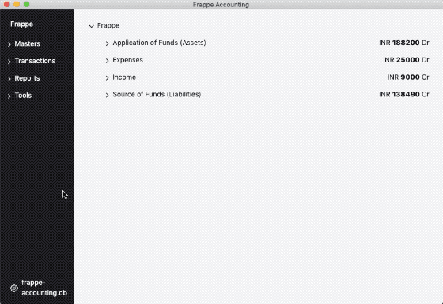

<div align="center">
    <h1>
      Frappe Accounting
    </h1>
    <h3>
      Simple app for personal and small businesses accounting
    </h3>
    <h5>
        it's pronounced - <em>fra-pay</em>
    </h5>
</div>

<p align="center">
    <a href="https://frappe.io/accounting">
        
    </a>
</p>

Frappe Accounting is built on [FrappeJS](https://github.com/frappe/frappejs) Framework a Full-Stack VueJS based meta-data driven web framework. Under the hood it uses Electron bundles.

### Installation

#### Step 0

Install build essentials

Ubuntu

```bash
apt-get install build-essential python git
apt-get install libgconf-2-4
```

MacOS

```bash
xcode-select --install
```

You will also need [Xcode App](https://apps.apple.com/in/app/xcode/id497799835?mt=12) from App Store

#### Step 1

Install [Node.js](https://nodejs.org/en/) (version 12.6.0)

> Tip: The best way to install and manage Node is to install [nvm](https://github.com/nvm-sh/nvm#usage)

#### Step 2

Install `yarn` package manager.

```bash
npm install -g yarn
```

#### Step 3

Clone this repo

```bash
git clone https://github.com/frappe/accounting.git
```

#### Step 4

Install dependencies and launch Accounting

```bash

cd accounting

# Install dependencies
yarn

# Start the electron app
yarn electron
```

### Troubleshooting

- If you are facing node-gyp errors then you may need to:
  1.  Install Xcode App from App Store.
  2.  Use node v12.6.0
  3.  Delete yarn.lock/package-lock.json
